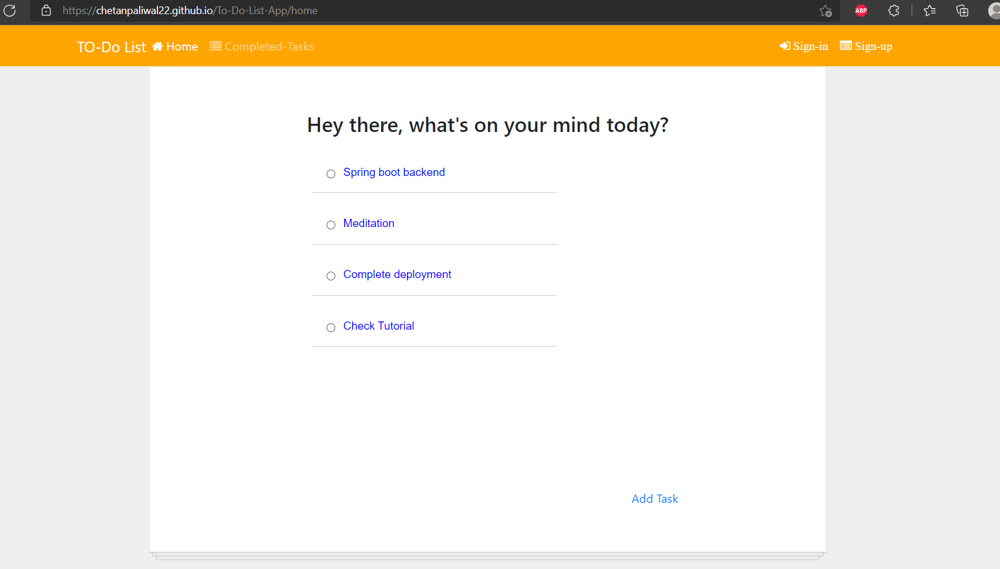

## What is React?

React is an open-sourced Javascript library for building user interfaces developed and maintained by Facebook developers.

## What is Firestore DB?

Firestore is a noSQL database that you can use to store and fetch user generated data.

## React To-Do App

A simple To-Do App to understand the basic functionality of React and noSQL database - Firebase.

This is motivated by [Scrimba](https://scrimba.com/) and [To-Do-App](https://github.com/AnjaliSharma1234/To-Do-App).

## Screenshot of the To-Do-List App

### To-Do-List App


### Add To-Do-Item


This project was bootstrapped with [Create React App](https://github.com/facebook/create-react-app).

## Getting Started - React.

### Installation Process

Follow the instructions for the ReactJS environment Setup given [here](https://www.tutorialspoint.com/reactjs/reactjs_environment_setup.htm)

Follow the steps to create a basic react application, connect it to firebase DB and finally deploy it to GitHub pages

#### Step1: Initiative a react app
```
npm install -g create-react-app
```
#### Step2: Create your react app
```
create-react-app your-app-name
```
#### Step3: Go to the your-app-name directory
```
cd your-app-name
```
#### Step4: Start and check the working of the application
```
npm start
```
You can use the source code of the current [repository](https://github.com/Chetanpaliwal22/To-Do-List-App) to get started with the basic application

### Steps to integrate To-Do-List-App to Firebase DB

#### Step 1: Signup for Firebase

Sign to [Firebase](https://firebase.google.com/) using your Google account, and click on GO TO CONSOLE(top-right). 

#### Step 2: Add project

Create an project by clicking on add project, For this tutorial we are keeping it as "To-Do-List-App".

#### Step 3: Create test rule for your DB

Click on the Database tile left sidebar, then click on create database. Select test rule as security rule, this will enable you use it without authentication. You can change security rule for a production build.

#### Step 4: Integrating Firebase to our application

Install the firebase package using the command
```
npm install firebase
```
Use the configuration given in the [firebase.js](https://github.com/Chetanpaliwal22/To-Do-List-App/blob/master/src/firebase.js) to use the firebase in our application

#### Step 5: Creating a Firebase database

Add a collection by clicking the "Add collection" button.

After setting up the new collection name, define a few data fields in the new document. Let's call it: id: number, completed: boolean, text: string for a to-do item.

Your collection in Firebase should look like this:


#### Step 6: DB operation on noSQL DB

Use the following code to save and delete data
Save:
```
 let newTask = {
      id: id,
      text: "task name",
      completed: false
    }
  db.collection('DataList').doc(id.toString()).set(newTask)
```
Delete:
```
db.collection("DataList")
          .doc(id)
          .delete()
```

### Deployment

#### Step1: Install the gh-pages package as a "dev-dependency" of the app
```
npm install gh-pages — save-dev
```
#### Step2: Add homepage property to package.json file

Open package.json and add
```
"homepage": "http://{Github-username}.github.io/{Github-repo-name}"
```
#### Step3: Deploy scripts under package.json file

In the existing scripts property, add a predeploy property and a deploy property, each having the values shown below:

```
“scripts”: {
“predeploy”: “npm run build”,
“deploy”: “gh-pages -d build”
}
```

#### Step4: Create a remote GitHub repository
(Skip this step if your remote GitHub repository is already initialized)
```
Initialize: git init
```
Add it as remote: git remote add origin your-github-repository-url.git


#### Step5: Now deploy it to GitHub Pages
```
npm run deploy
```
## Hey Congratulations!! your application is deployed to GitHubPages

## Project Admin

|  |
| :----------------------------------------------------------: |
| **[Chetan Paliwal](https://www.linkedin.com/in/Chetanpaliwal22/)**  |

[](https://github.com/Chetanpaliwal22/) 
